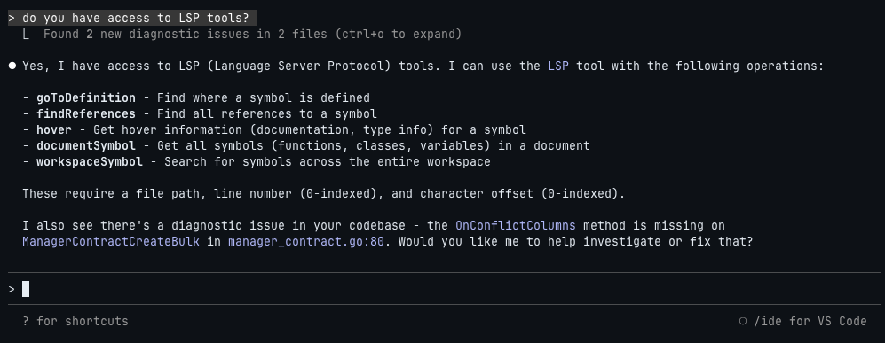

# Claude Code LSPs

A collection of Language Server Protocol (LSP) plugins for [Claude Code](https://github.com/anthropics/claude-code).



## What is LSP Integration?

> [!WARNING]
> **Known Issue:** LSP integration is broken since ~v2.0.69. Root cause is a race condition where LSP Manager initializes before plugins finish loading ([#14803](https://github.com/anthropics/claude-code/issues/14803), [#13952](https://github.com/anthropics/claude-code/issues/13952)). PRs are in flight to fix this. Workaround: downgrade to v2.0.67 and set `ENABLE_LSP_TOOL=1`.

The Language Server Protocol provides IDE-like intelligence to Claude Code. On startup, Claude Code automatically starts LSP servers from installed plugins and exposes them to Claude in two ways:

**LSP Tool** - A builtin tool with 9 operations mapping directly to LSP commands:

| Operation              | Description                                                     |
| ---------------------- | --------------------------------------------------------------- |
| `goToDefinition`       | Find where a symbol is defined                                  |
| `findReferences`       | Find all references to a symbol                                 |
| `hover`                | Get hover info (docs, type info) for a symbol                   |
| `documentSymbol`       | Get all symbols (functions, classes, variables) in a document   |
| `workspaceSymbol`      | Search for symbols across the entire workspace                  |
| `goToImplementation`   | Find implementations of an interface/abstract method            |
| `prepareCallHierarchy` | Get call hierarchy item at a position                           |
| `incomingCalls`        | Find all functions/methods that call the function at a position |
| `outgoingCalls`        | Find all functions/methods called by the function at a position |

**Automatic Diagnostics** - Real-time error and warning detection similar to the VS Code integration, but operating independently. These diagnostics tend to be faster and more comprehensive than the VS Code equivalent.

## Available Plugins

| Plugin                                             | Language              | Extensions                                  | LSP                                                                              |
| -------------------------------------------------- | --------------------- | ------------------------------------------- | -------------------------------------------------------------------------------- |
| [bash-language-server](./bash-language-server)     | Bash/Shell            | `.sh` `.bash` `.zsh` `.ksh`                 | [bash-language-server](https://github.com/bash-lsp/bash-language-server)         |
| [clangd](./clangd)                                 | C/C++                 | `.c` `.h` `.cpp` `.hpp` `.cc` `.cxx` `.hxx` | [clangd](https://clangd.llvm.org/)                                               |
| [clojure-lsp](./clojure-lsp)                       | Clojure               | `.clj` `.cljs` `.cljc` `.edn`               | [clojure-lsp](https://github.com/clojure-lsp/clojure-lsp)                        |
| [dart-analyzer](./dart-analyzer)                   | Dart/Flutter          | `.dart`                                     | [Dart SDK](https://dart.dev/tools/dart-analyze)                                  |
| [elixir-ls](./elixir-ls)                           | Elixir                | `.ex` `.exs`                                | [elixir-ls](https://github.com/elixir-lsp/elixir-ls)                             |
| [gleam](./gleam)                                   | Gleam                 | `.gleam`                                    | [gleam](https://gleam.run/)                                                      |
| [gopls](./gopls)                                   | Go                    | `.go`                                       | [gopls](https://github.com/golang/tools/tree/master/gopls)                       |
| [intelephense](./intelephense)                     | PHP                   | `.php` `.phtml`                             | [Intelephense](https://github.com/bmewburn/intelephense-docs)                    |
| [jdtls](./jdtls)                                   | Java                  | `.java`                                     | [jdtls](https://github.com/eclipse-jdtls/eclipse.jdt.ls)                         |
| [kotlin-language-server](./kotlin-language-server) | Kotlin                | `.kt` `.kts`                                | [kotlin-language-server](https://github.com/fwcd/kotlin-language-server)         |
| [lua-language-server](./lua-language-server)       | Lua                   | `.lua`                                      | [lua-language-server](https://github.com/LuaLS/lua-language-server)              |
| [nixd](./nixd)                                     | Nix                   | `.nix`                                      | [nixd](https://github.com/nix-community/nixd)                                    |
| [ocaml-lsp](./ocaml-lsp)                           | OCaml                 | `.ml` `.mli`                                | [ocaml-lsp](https://github.com/ocaml/ocaml-lsp)                                  |
| [omnisharp](./omnisharp)                           | C#                    | `.cs` `.csx`                                | [OmniSharp](https://github.com/OmniSharp/omnisharp-roslyn)                       |
| [pyright](./pyright)                               | Python                | `.py` `.pyi`                                | [pyright](https://github.com/microsoft/pyright)                                  |
| [rust-analyzer](./rust-analyzer)                   | Rust                  | `.rs`                                       | [rust-analyzer](https://github.com/rust-lang/rust-analyzer)                      |
| [solargraph](./solargraph)                         | Ruby                  | `.rb` `.rake` `.gemspec`                    | [Solargraph](https://github.com/castwide/solargraph)                             |
| [sourcekit-lsp](./sourcekit-lsp)                   | Swift                 | `.swift`                                    | [sourcekit-lsp](https://github.com/swiftlang/sourcekit-lsp)                      |
| [terraform-ls](./terraform-ls)                     | Terraform             | `.tf` `.tfvars`                             | [terraform-ls](https://github.com/hashicorp/terraform-ls)                        |
| [vtsls](./vtsls)                                   | TypeScript/JavaScript | `.ts` `.tsx` `.js` `.jsx` `.mjs` `.cjs`     | [vtsls](https://github.com/yioneko/vtsls)                                        |
| [yaml-language-server](./yaml-language-server)     | YAML                  | `.yaml` `.yml`                              | [yaml-language-server](https://github.com/redhat-developer/yaml-language-server) |
| [zls](./zls)                                       | Zig                   | `.zig` `.zon`                               | [zls](https://github.com/zigtools/zls)                                           |

## Getting Started

### 1. Add the Marketplace

```bash
claude
/plugin marketplace add boostvolt/claude-code-lsps
```

### 2. Install Plugins

Install individual plugins:

```bash
/plugin install bash-language-server@claude-code-lsps
/plugin install clangd@claude-code-lsps
/plugin install clojure-lsp@claude-code-lsps
/plugin install dart-analyzer@claude-code-lsps
/plugin install elixir-ls@claude-code-lsps
/plugin install gleam@claude-code-lsps
/plugin install gopls@claude-code-lsps
/plugin install intelephense@claude-code-lsps
/plugin install jdtls@claude-code-lsps
/plugin install kotlin-language-server@claude-code-lsps
/plugin install lua-language-server@claude-code-lsps
/plugin install nixd@claude-code-lsps
/plugin install ocaml-lsp@claude-code-lsps
/plugin install omnisharp@claude-code-lsps
/plugin install pyright@claude-code-lsps
/plugin install rust-analyzer@claude-code-lsps
/plugin install solargraph@claude-code-lsps
/plugin install sourcekit-lsp@claude-code-lsps
/plugin install terraform-ls@claude-code-lsps
/plugin install vtsls@claude-code-lsps
/plugin install yaml-language-server@claude-code-lsps
/plugin install zls@claude-code-lsps
```

Or browse and install interactively:

```bash
/plugin
```

---

## Manual LSP Installation

Each plugin will attempt to auto-install its LSP server on first use. If auto-install fails, use the manual instructions below.

<details>
<summary><strong>Bash/Shell (bash-language-server)</strong></summary>

```bash
brew install bash-language-server
```

Or via npm:

```bash
npm install -g bash-language-server
```

</details>

<details>
<summary><strong>C/C++ (clangd)</strong></summary>

```bash
brew install llvm
```

Or via Xcode Command Line Tools:

```bash
xcode-select --install
```

</details>

<details>
<summary><strong>C# (omnisharp)</strong></summary>

```bash
brew install omnisharp/omnisharp-roslyn/omnisharp-mono
```

Or via dotnet:

```bash
dotnet tool install -g csharp-ls
```

</details>

<details>
<summary><strong>Clojure (clojure-lsp)</strong></summary>

```bash
brew install clojure-lsp/brew/clojure-lsp-native
```

Or download from [GitHub releases](https://github.com/clojure-lsp/clojure-lsp/releases).

</details>

<details>
<summary><strong>Dart/Flutter (dart-analyzer)</strong></summary>

Install Dart SDK:

```bash
brew tap dart-lang/dart
brew install dart
```

Or install Flutter (includes Dart):

```bash
# See https://docs.flutter.dev/get-started/install
```

Ensure `dart` is in your PATH.

</details>

<details>
<summary><strong>Elixir (elixir-ls)</strong></summary>

```bash
brew install elixir-ls
```

Requires Elixir to be installed:

```bash
brew install elixir
```

</details>

<details>
<summary><strong>Gleam (gleam)</strong></summary>

```bash
brew install gleam
```

Or download from [GitHub releases](https://github.com/gleam-lang/gleam/releases).

</details>

<details>
<summary><strong>Go (gopls)</strong></summary>

```bash
go install golang.org/x/tools/gopls@latest
```

Ensure `~/go/bin` is in your PATH.

</details>

<details>
<summary><strong>Java (jdtls)</strong></summary>

```bash
brew install jdtls
```

Or download manually from [Eclipse JDT Language Server](http://download.eclipse.org/jdtls/snapshots/).

Requires Java 21+ runtime.

</details>

<details>
<summary><strong>Kotlin (kotlin-language-server)</strong></summary>

```bash
brew install kotlin-language-server
```

</details>

<details>
<summary><strong>Lua (lua-language-server)</strong></summary>

```bash
brew install lua-language-server
```

Or download from [GitHub releases](https://github.com/LuaLS/lua-language-server/releases).

</details>

<details>
<summary><strong>Nix (nixd)</strong></summary>

```bash
nix profile install nixpkgs#nixd
```

Requires Nix to be installed. See [nixos.org](https://nixos.org/download/).

</details>

<details>
<summary><strong>OCaml (ocaml-lsp)</strong></summary>

```bash
opam install ocaml-lsp-server
```

Requires opam to be installed:

```bash
brew install opam
opam init
```

</details>

<details>
<summary><strong>PHP (intelephense)</strong></summary>

```bash
npm install -g intelephense
```

</details>

<details>
<summary><strong>Python (pyright)</strong></summary>

```bash
pip install pyright
```

</details>

<details>
<summary><strong>Ruby (solargraph)</strong></summary>

```bash
gem install solargraph
```

</details>

<details>
<summary><strong>Rust (rust-analyzer)</strong></summary>

```bash
brew install rust-analyzer
```

Or via rustup:

```bash
rustup component add rust-analyzer
```

</details>

<details>
<summary><strong>Swift (sourcekit-lsp)</strong></summary>

sourcekit-lsp is bundled with Xcode. Install Xcode from the App Store:

```bash
# Verify installation
xcrun --find sourcekit-lsp
```

Or install a Swift toolchain from [swift.org/install](https://swift.org/install/).

</details>

<details>
<summary><strong>Terraform (terraform-ls)</strong></summary>

```bash
brew install terraform-ls
```

Or download from [GitHub releases](https://github.com/hashicorp/terraform-ls/releases).

</details>

<details>
<summary><strong>TypeScript/JavaScript (vtsls)</strong></summary>

```bash
npm install -g @vtsls/language-server typescript
```

</details>

<details>
<summary><strong>YAML (yaml-language-server)</strong></summary>

```bash
brew install yaml-language-server
```

Or via npm:

```bash
npm install -g yaml-language-server
```

</details>

<details>
<summary><strong>Zig (zls)</strong></summary>

```bash
brew install zls
```

Requires Zig to be installed. Download from [ziglang.org](https://ziglang.org/download/).

</details>

---

## Creating Your Own Plugin

<details>
<summary><strong>Plugin Structure</strong></summary>

```
my-lsp/
├── .claude-plugin/
│   └── plugin.json
├── .lsp.json
└── hooks/
    ├── hooks.json
    └── check-my-lsp.sh
```

</details>

<details>
<summary><strong>.lsp.json Schema</strong></summary>

The `.lsp.json` file configures the language server:

```json
{
  "language-id": {
    "command": "lsp-server-command",
    "extensionToLanguage": {
      ".ext": "language-id"
    }
  }
}
```

**Required Fields**

| Field                 | Type   | Description                          |
| --------------------- | ------ | ------------------------------------ |
| `command`             | string | Command to start the LSP server      |
| `extensionToLanguage` | object | Maps file extensions to language IDs |

**Optional Fields**

| Field                   | Type     | Description                                                       |
| ----------------------- | -------- | ----------------------------------------------------------------- |
| `args`                  | string[] | Arguments passed to the command                                   |
| `transport`             | string   | Communication method: `"stdio"` (default) or `"socket"`           |
| `env`                   | object   | Environment variables to set when starting the server             |
| `initializationOptions` | object   | Options passed during LSP initialization                          |
| `settings`              | object   | Server-specific settings via `workspace/didChangeConfiguration`   |
| `workspaceFolder`       | string   | Workspace folder path for the server                              |
| `startupTimeout`        | number   | Max time to wait for server startup (milliseconds)                |
| `shutdownTimeout`       | number   | Max time to wait for graceful shutdown (milliseconds)             |
| `restartOnCrash`        | boolean  | Whether to automatically restart the server if it crashes         |
| `maxRestarts`           | number   | Max restart attempts before giving up (default: 3)                |
| `loggingConfig`         | object   | Debug logging configuration (see [Debug Logging](#debug-logging)) |

</details>

<details>
<summary><strong>Example: gopls</strong></summary>

`.lsp.json`:

```json
{
  "go": {
    "command": "gopls",
    "extensionToLanguage": {
      ".go": "go"
    },
    "loggingConfig": {
      "args": ["-rpc.trace", "-logfile", "${CLAUDE_PLUGIN_LSP_LOG_FILE}"]
    }
  }
}
```

`.claude-plugin/plugin.json`:

```json
{
  "name": "gopls",
  "description": "Go language server",
  "version": "1.0.0",
  "author": {
    "name": "Your Name"
  },
  "hooks": "./hooks/hooks.json",
  "lspServers": "./.lsp.json"
}
```

`hooks/hooks.json` (optional auto-install):

```json
{
  "hooks": {
    "SessionStart": [
      {
        "hooks": [
          {
            "type": "command",
            "command": "bash ${CLAUDE_PLUGIN_ROOT}/hooks/check-gopls.sh",
            "timeout": 30
          }
        ]
      }
    ]
  }
}
```

</details>

---

## Debug Logging

Enable verbose LSP logging by running Claude Code with `--enable-lsp-logging`:

```bash
claude --enable-lsp-logging
```

Logs are written to `~/.claude/debug/`.

**Plugins with logging pre-configured:**

| Plugin                 | Method                             |
| ---------------------- | ---------------------------------- |
| bash-language-server   | `BASH_IDE_LOG_LEVEL` env           |
| clangd                 | `--log=verbose`                    |
| clojure-lsp            | `--trace-level verbose`            |
| dart-analyzer          | `--instrumentation-log-file`       |
| gopls                  | `-rpc.trace` + logfile             |
| lua-language-server    | `--loglevel=trace` + `--logpath`   |
| omnisharp              | `-v` verbose flag                  |
| rust-analyzer          | `RA_LOG` + `RA_LOG_FILE` env       |
| solargraph             | `SOLARGRAPH_LOG` env               |
| sourcekit-lsp          | `--log-level debug`                |
| terraform-ls           | `TF_LOG` + `TF_LOG_PATH` env       |
| zls                    | `--log-level` + `--log-file`       |

**Not supported** (use LSP trace settings instead): elixir-ls, gleam, intelephense, jdtls, kotlin-language-server, nixd, ocaml-lsp, pyright, vtsls, yaml-language-server

## License

MIT
